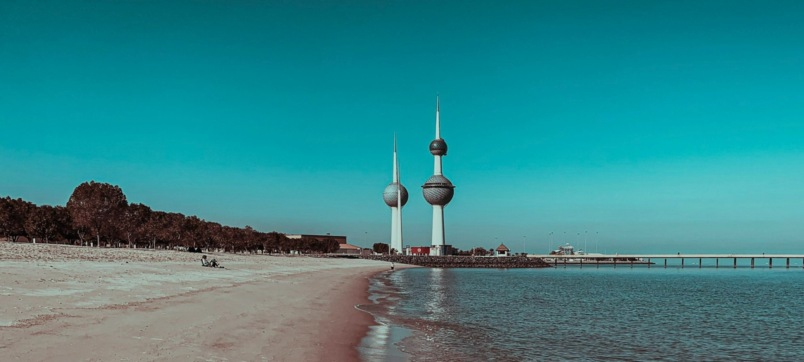

<h1 Align="center">Hi 👋, I'm Rabbit</h1>
<h3 Align="center">A passionate full-Stack developer from Kuwait</h3>

 
   

---

### 👨‍💻 About Me

- 🌱 I’m currently learning **C Language** and **machine learning in python**.
- 👯 I’m looking to collaborate on [PyBattle](https://github.com/rabbitq8/PyBattle).
- 💬 Ask me about **Python, Kotlin, HTML, CSS**.
- 📫 How to reach me: [Github](https://github.com/rabbitq8).
- ⚡ Fun fact: **I Love to Learn New Things!**

---

### 🛠️ technologies &AMP; Tools

- **Programming Languages**: Python, Kotlin, C (Learning)
- **Web Development**: html, css
- **Tools**: Git, GitHub

---

### 🚀 My Projects

All of my projects are available on my GitHub profile. Check them out below!  
🔗 [View My Repositories](https://github.com/rabbitq8?tab=repositories)

---

### 📈 GitHub Stats

---

### 🌟 Let's Connect!

Feel free to reach out if you'd like to collaborate or just chat about tech!  
🔗 [GitHub Profile](https://github.com/rabbitq8)

---
